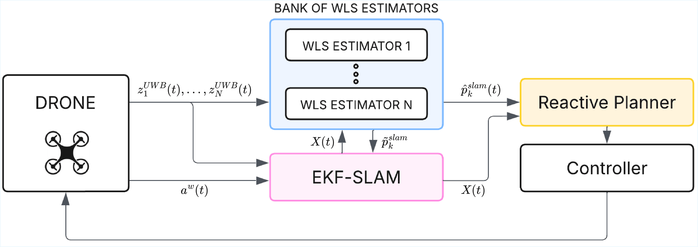
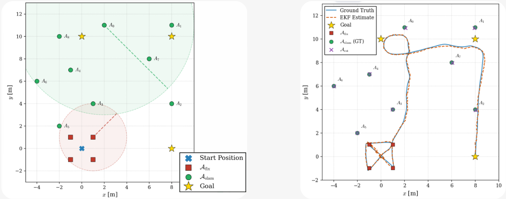

# UWB Obstacle-Aware Active SLAM 

This is the repo of the paper "UWB-based Active SLAM for UAVs in GNSS-Denied Environments" accepted at IEEE I2MTC 2026, Nancy. The code implements a UWB SLAM system that enables autonomous UAV navigation with no prior knowledge of the environment. Given a goal position, the drone moves while maximizing its localization observability.

The paper is available [here](docs/paper/I2MTC26___UWB_EKF_SLAM___Nascivera.pdf).

## Demo


*Active SLAM planner in action: the drone navigates while mapping UWB anchors online.*

## System Architecture



## Results



*Left: scenario setup with fixed anchors (red squares) and SLAM anchors (green circles). Right: ground truth vs EKF estimate trajectory.*
---

## Overview

The framework integrates:

- EKF-based range-only SLAM  
- IMU acceleration fusion  
- Bank of Weighted Least Squares (WLS) estimators for robust anchor initialization  
- Flip-ambiguity detection and rejection  
- Observability-aware reactive planning  
- RViz visualization support  
- Monte Carlo simulation capability  

The planner actively modifies the trajectory to:

- Resolve geometric symmetries  
- Improve Fisher Information conditioning  
- Reduce landmark initialization failures  

---

## Package Structure

```
obs_aware_slam/
├── position_UWB.py      # Main ROS2 node (EKF + Planner + SLAM logic)
├── ekf_uwb.py           # EKF-SLAM implementation
├── wls_est.py           # WLS anchor initialization
├── rp_class.py          # Reactive Planner
├── RVIZ_visualizer.py   # Visualization markers
├── utils.py             # Utilities
├── package.xml
├── setup.py
└── setup.cfg
```

---

## Dependencies

- ROS2 (tested on Humble)  
- rclpy  
- nav_msgs  
- std_msgs  
- visualization_msgs  
- px4_msgs  
- numpy  

---

## Installation

Clone inside your ROS2 workspace:

```bash
cd ~/your_ws/src
git clone https://github.com/davidenascivera/UWB-Obs-Aware-SLAM.git
```

Build:

```bash
cd ~/your_ws
colcon build --packages-select obs_aware_slam
source install/setup.bash
```

---

## Usage

Run the main SLAM node:

```bash
ros2 run obs_aware_slam position_ekf
```

In a separate terminal, run the planner:

```bash
ros2 run obs_aware_slam slam_planner_vel
```

To visualize in RViz2:

```bash
rviz2
```
---

## Notes

- Anchors with known positions are used for initial localization.  
- Unknown anchors are initialized via WLS before being added to the EKF state.  
- The reactive planner prevents flip ambiguity during range-only SLAM.  

---

## License

MIT